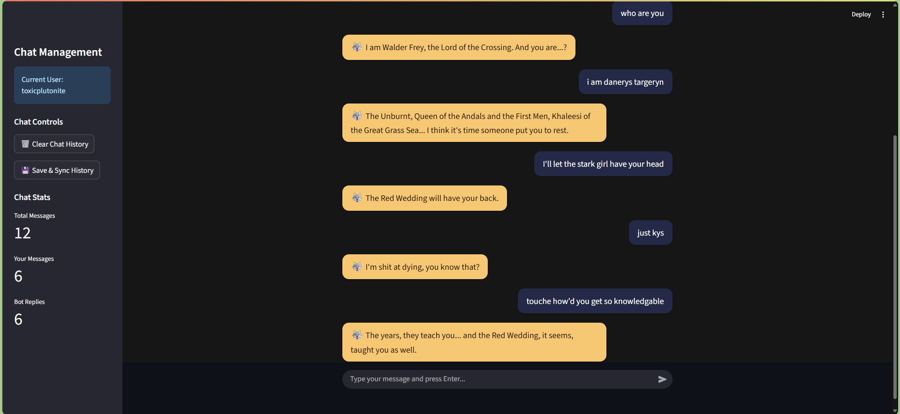

# A GameOfThrones chatbot 

A Streamlit-powered chatbot packed with the wisdom of Westeros that responds in the style of Game of Thrones characters using real quotes from the series. Quotes are sourced from [shevabam/game-of-thrones-quotes-api](https://github.com/shevabam/game-of-thrones-quotes-api/blob/master/datas.json) .

<p align="center">
  
</p>
<p align="center">
  
</p>
Ask for relationship advice at your own discretion—the lords and ladies of Westeros aren’t exactly known for their happy endings!

## Usage
1. set GROQ_API_KEY in .env
2. ```streamlit run app.py```

## Example Interactions

| User Message         | Bot Reply                                 |
|----------------------|-------------------------------------------|
| It's so cold         | Winter is coming.                         |
| I lost in chess      | When you play the game of chess, you win or you die. There is no middle ground. |
| There are so many ants | Burn them all.                          |


## Chat History Features
1. Persistent Conversations: Chat history is saved and restored between sessions

2. Context Awareness: Bot remembers previous messages for more natural conversations

3. Multi-User Support: Each user gets their own isolated chat history

4. Chat Management: Clear history, sync conversations, and view chat statistics
